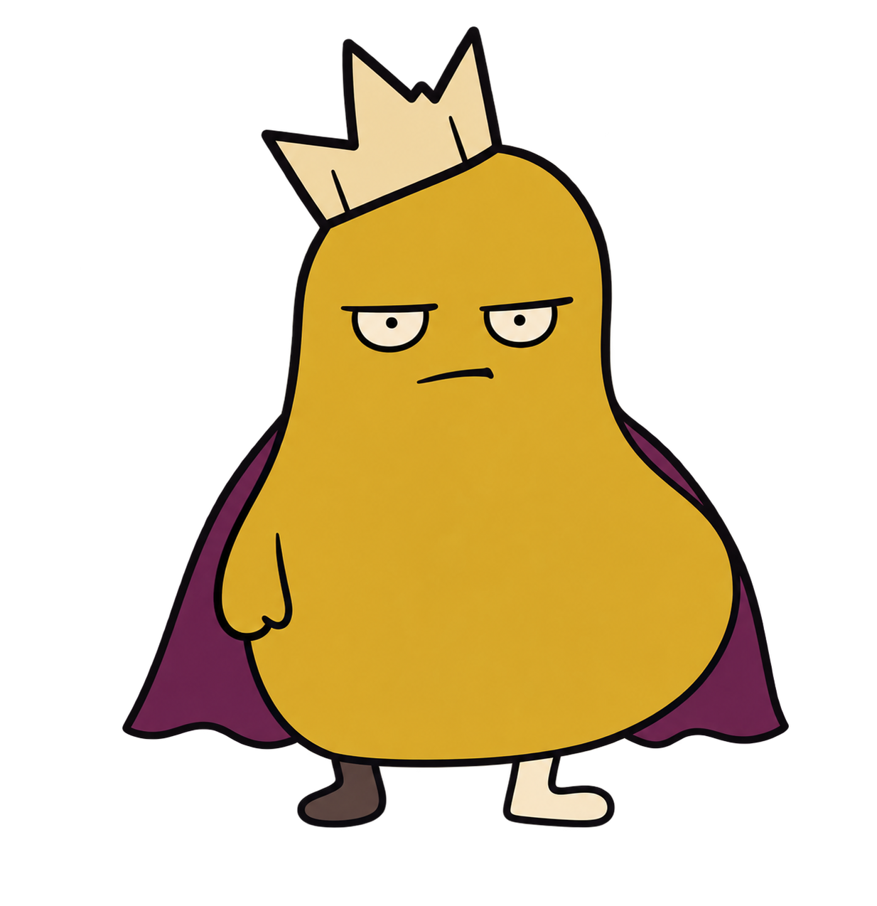
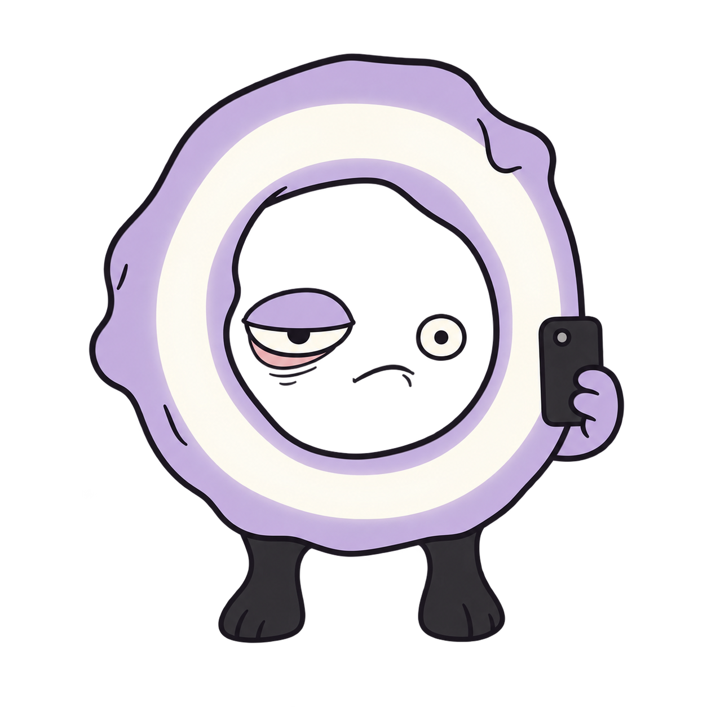
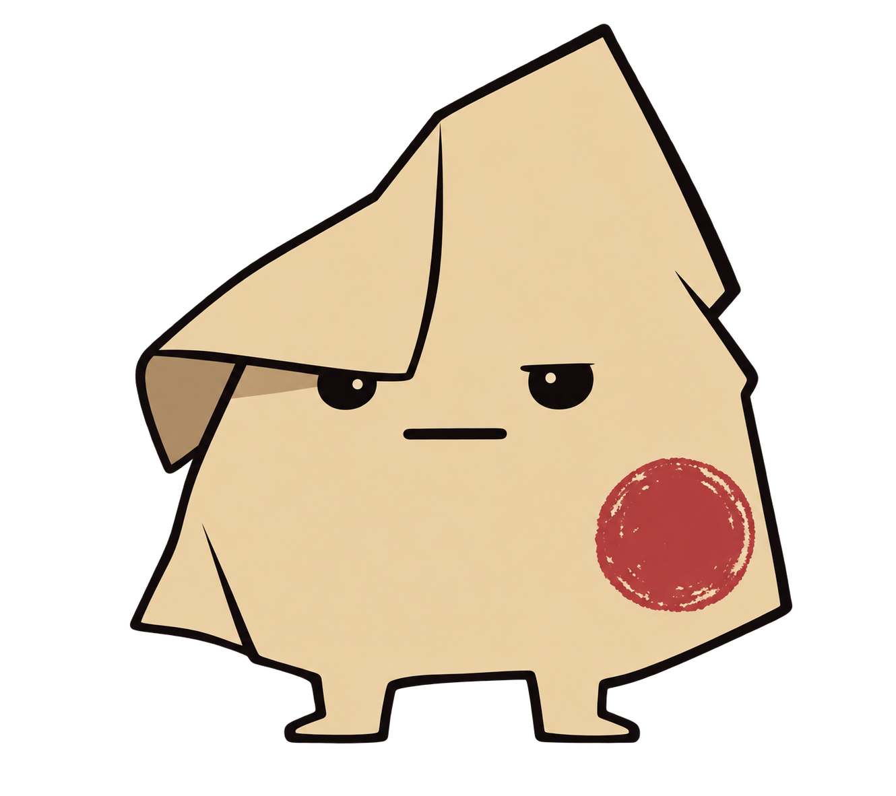
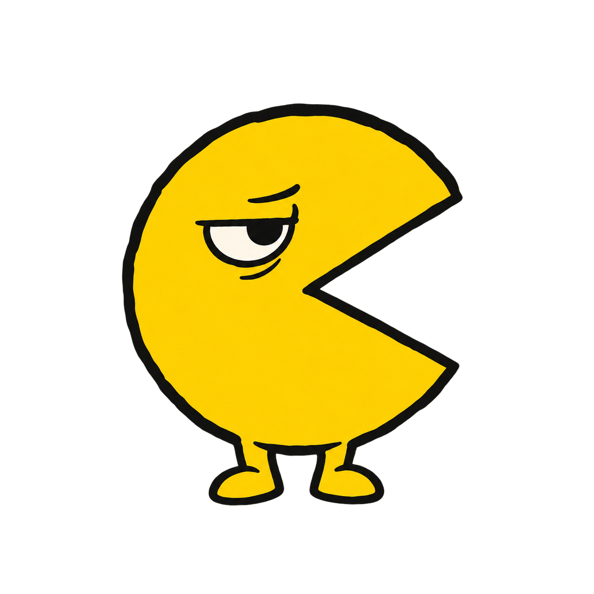
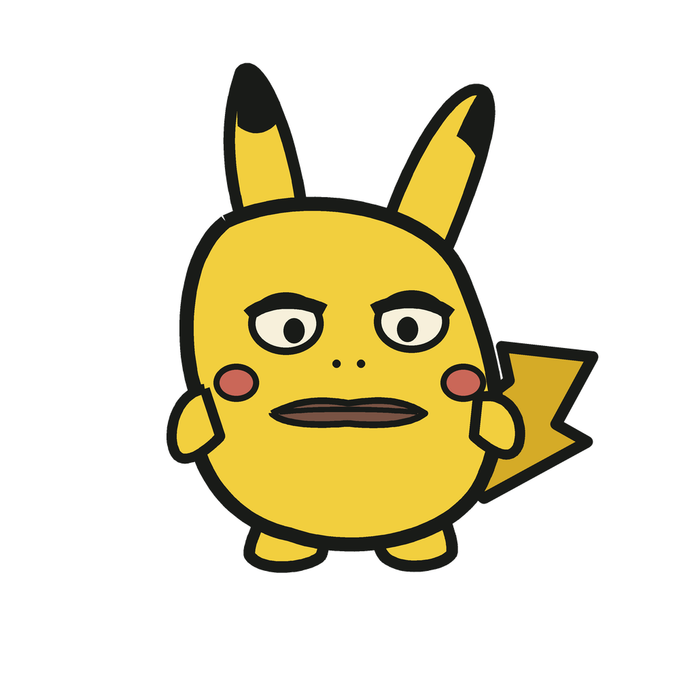
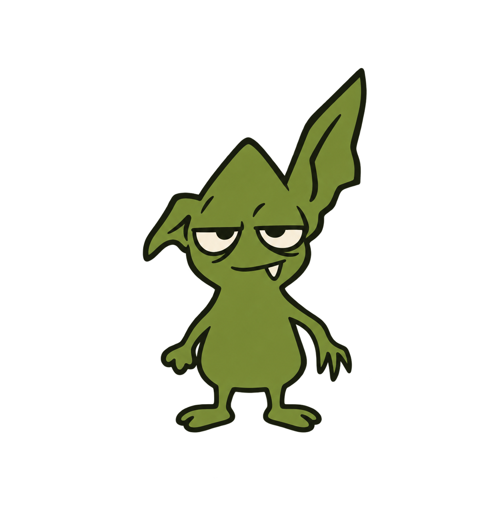
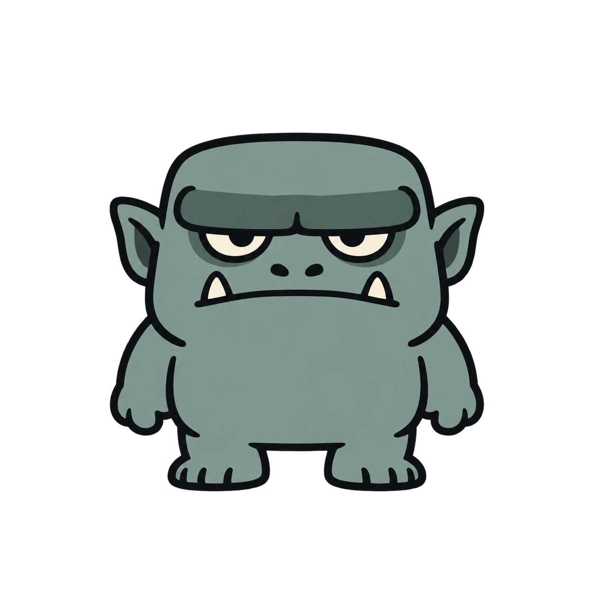

# Propuestas de mascotas

## Dirección aprobada: abstractas y compactas

La primera ronda fue descartada por verse infantil y demasiado detallada. Las referencias anteriores siguen archivadas en sus carpetas; no forman parte del catálogo. Esta ronda sigue la colección: siluetas pequeñas y simples, contorno oscuro, rellenos planos, hasta cuatro colores y un solo detalle absurdo. El humor es seco y viene de la forma y la expresión.

### Elegido de Oferta

Un bulto amarillo coronado como héroe épico, con una capa barata y cara de estar esperando que termine la profecía.

1234×1274, PNG RGBA, alpha 0–255. SHA-256: `aef96cbd4d908f6896ee262616a589dbd190a116d26340e82691bf67e20ca56f`.

### Influencer del Abismo

Un aro de luz con piernas y una cara inexplicablemente aburrida: creador de contenido cósmico que no tiene nada que contar.

1254×1254, PNG RGBA, alpha 0–255. SHA-256: `ea474f57d7d982dee86a03a4b823d18304d98aa9f5dc5050510fe000a7cdeade`.

### Ventanilla Cero

Un pliegue de papel con sello rojo y cara de trámite eterno; el funcionario de un universo que nadie pidió visitar.

1330×1182, PNG RGBA, alpha 0–255. SHA-256: `aa23f52dba5826583754ff73317302a6961b216d232b77c3fc40441ebddda8f1`.

## Ronda siguiente: cuatro personajes conocidos y criaturas

Estas son referencias nuevas en el mismo formato compacto. Son propuestas visuales, no packs de 25 vistas y 12 reacciones ni entradas del catálogo.

### Pac-Man

Un círculo amarillo con mandíbula en cuña y mirada de lunes: se reconoce incluso sin detalles pequeños.

1254×1254, PNG RGBA, alpha 0–255. SHA-256: `eea9cccd334fe1206de3794170d0d9fe19fcbfb1aa99ecdd43aa2619eb82e05a`.

### Pikachu con cara de Apu Apustaja

Ratón eléctrico amarillo de silueta simple, orejas oscuras y cola en rayo, con los párpados pesados y la boca plana de [Apu Apustaja](https://knowyourmeme.com/memes/apu-apustaja). Los dos ojos miran al frente; la expresión no depende de bizquearlos. Tras tres bloqueos de salida del generador, esta referencia se dibujó como vector reproducible en `round-4/pikachu-apu/render.py`.

1024×1024, PNG RGBA, alpha 0–255. SHA-256: `404ad7f0352e5a1034db316b4f35c681701e18c04c8297f1c7eaf0d55916ca62`. Fuente `render.py` SHA-256: `0e511f03d0cfdef8f5c47529563bba3c5b68e6c5035359fa900243553ab76d25`.

### Goblin

Flaco, verde oliva, una oreja demasiado larga y cara de que sabe algo pero no lo dirá.

1246×1263, PNG RGBA, alpha 0–255. SHA-256: `5ea65cd5fec4ec53b8e2d9fcc84864073ac30b842d4335fff36b73e40f85ae25`.

### Orco

Un bloque azul verdoso, pesado y casi inmóvil, con dos colmillos minúsculos y mirada cansada. Su masa lo distingue del goblin.

1254×1254, PNG RGBA, alpha 0–255. SHA-256: `8cdb0c4a2bdfdc29818dddd043a45bc46d678a0ef19c9234686296f5c74a70c0`.

## Siguiente fase

Estas imágenes son referencias de identidad, todavía no mascotas listas para runtime ni están publicadas. Para cada elegida: generar un piloto 2×2 y revisar frente, giros izquierda/derecha y una reacción; después crear las 25 direcciones en cinco tiras y las 12 reacciones en dos hojas, siempre con cuerpo y cabeza completos. Separar y revisar cada recorte, corregir derivas pequeñas de color con nivelado enmascarado, probar cada mirada en el playground y publicar solo tras la revisión manual de los 25 objetivos. Mantener hashes y fuentes separados por mascota. En particular, las orejas y la cola del ratón, la cuña de Pac-Man y la única oreja larga del goblin son rasgos de identidad que se deben conservar al girar.
